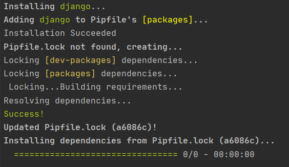
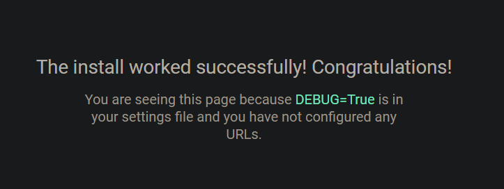
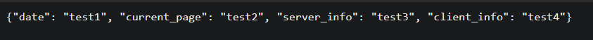
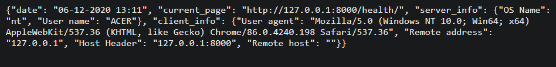
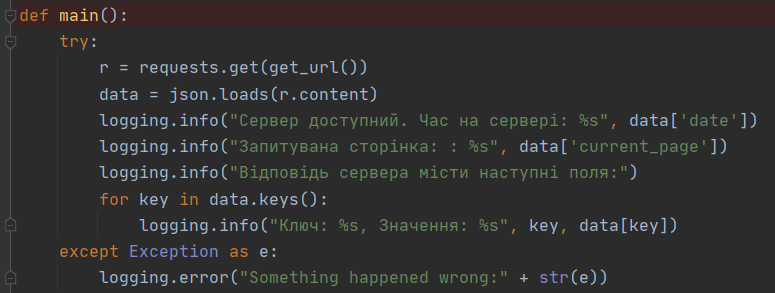
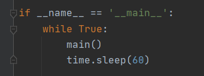
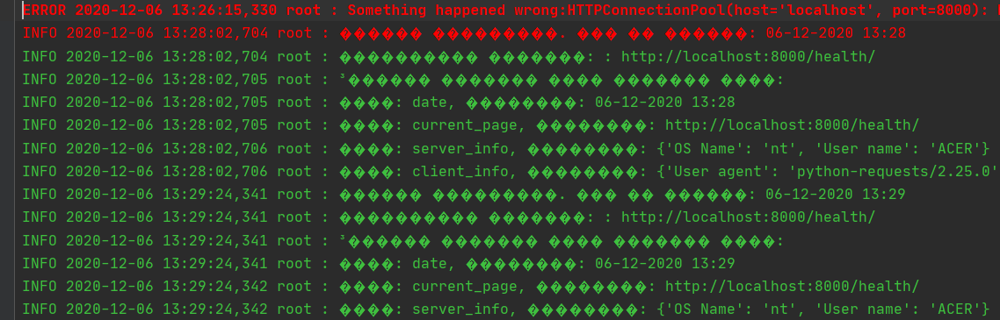

1. Встановила django framework:

2. Створила заготовку проекта template.

3. Перевірила роботу django сервера:

4. Створила дві сторінки main & health

5. Модифікувала функцію health:

6. Дописала функціонал, що виводить повідомлення про недоступність сайту:

7. Програма працює на бекграунді:

8. Створила alias:
[scripts]
server = "python manage.py runserver"
app = "python manage.py startapp main"

9. Добавила файл із логами:
