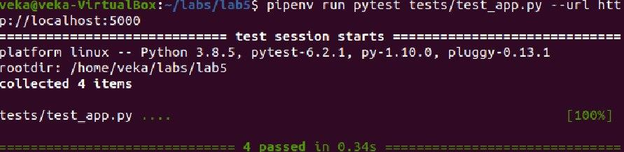
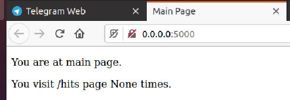
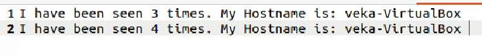
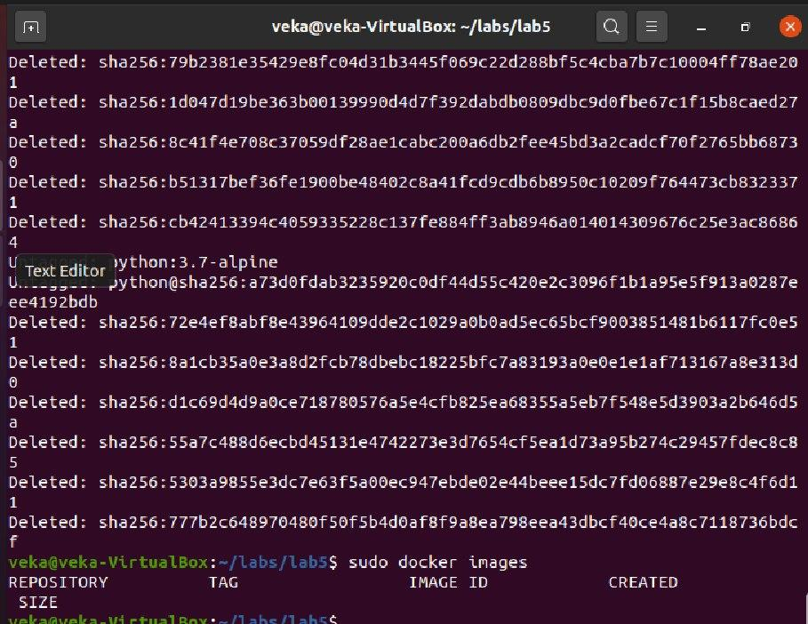

1. Створюю папку my_app, в якій буде знаходитись проект. Створюю папку tests, де будуть тести на перевірку працездатності проекту. 

2. Ініціалізація середовища для тестів у іншій вкладці шелу за допомогою команди 
pipenv run pytest tests/test_app.py --url http://localhost:5000:

3. Створюю два Dockerfile з іменами, як у цьому репозиторію, та Makefile, який допоможе автоматизувати процес розгортання.

4.Білд і запуск контейнеру за допомогою make app && make run, запуск тестів за допомогою make tests && make test-app:

5.Створюю директиви push та delete для добавлення та видалення репозиторіїв:

6.Створила docker-compose.yml. 

public - у цій мережі працює веб-інтерфейс програми;
secret - ця мережа використовується для комунікації з redis.

7. Запустила docker-compose:
sudo docker-compose -p lab5 up

8.Репозиторій з імеджами  docker-compose: https://hub.docker.com/r/viktoriiacherevan/lab5.

9. Створила docker-compose.yaml для лабораторної №4.